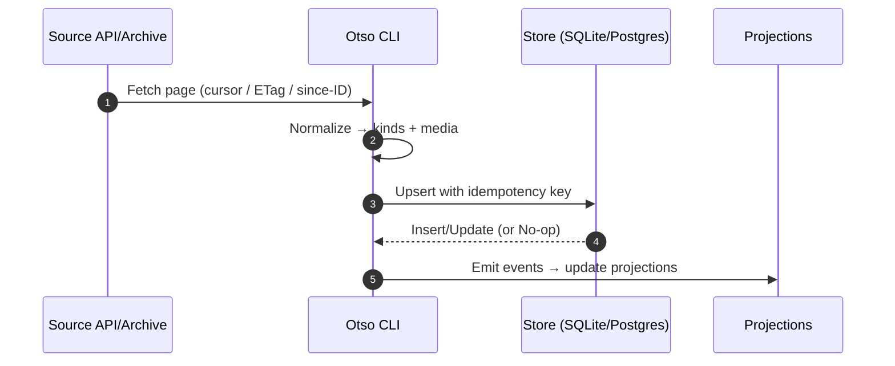
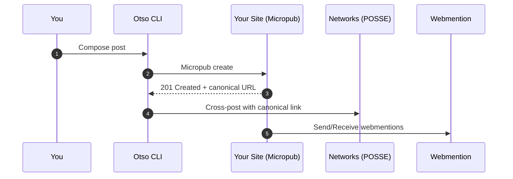
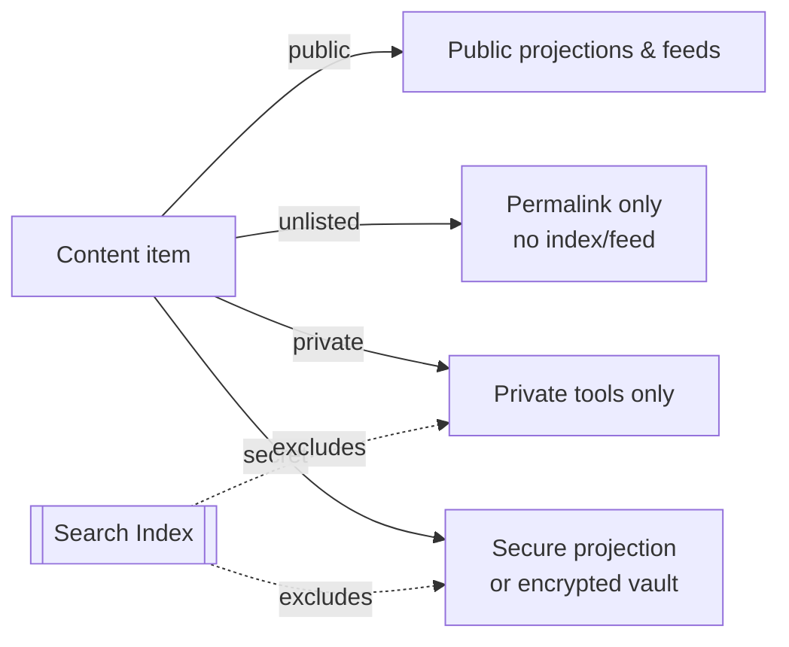

```mermaid
graph LR
  S[Sources<br/>(APIs, archives)] --> C[Otso CLI]
  C --> DB[(SQLite / Postgres)]
  C --> E[Enrichment<br/>(Defuddle, AI, tags)]
  C --> D[Svelte Dashboard]
  DB --> PR[Projections<br/>(tables, JSON, search)]
  PR --> UI[Your Site & UI]
  C --> M[Micropub → Your Site]
  M --> W[Webmention]
  C --> P[POSSE → Mastodon / Bluesky / …]

  classDef store fill:#2b5,stroke:#185,stroke-width:1,color:#fff;
  class DB,PR store;
```

## Core concepts

- Events: append‑only records of actions (imported, enriched, published). Easy to audit and replay.
- Projections: derived tables/JSON/search indexes for fast reads. Rebuildable on demand.
- Adapters: thin plugins for sources (imports) and publishers (POSSE, Micropub).

## Storage: SQLite or Postgres

- Start with SQLite: fast, simple, great for local use and CLIs.
- Move to Postgres when you want concurrent writers, external services, or hosted ops.
- Replication and backup: use Litestream/LiteFS for SQLite; standard tools for Postgres.

## Import flow (any API or archive)



## Publish flow (your site is the source)



## Privacy & visibility



- Credentials live in env vars or OS keychain; never in the repo or search indexes.

## What lives where

- Core SDK: stable data model, command surface, and utilities (rate limits, media).
- Plugins: per‑service logic (API/format quirks) and small mapping functions.
- Site/UI: thin layers over projections; easy to swap or customize.

This separation keeps Otso fast to use, easy to reason about, and safe to extend.
